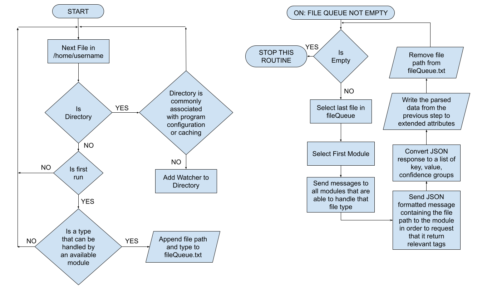
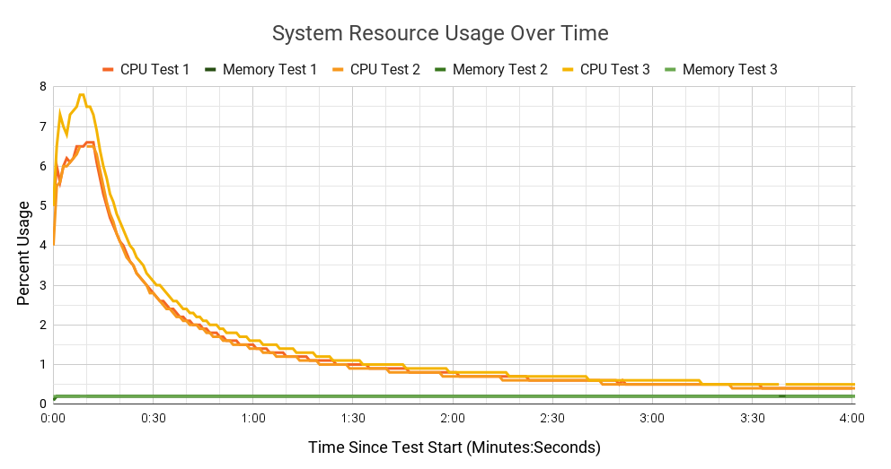

# Summary
Metadata is an incredibly valuable asset in the modern world. File metadata in particular can be leveraged by programs in order to improve a wide range of user experiences. In order to meet this demand for metadata, we developed and tested a framework for automatically mining and saving useful file metadata on a user’s system. The framework continuously watches for files of specific types within specific directories that are specified in a configuration file. The configuration file also contains a list of external programs that implement a standard file analyzer interface, and the file types that each program operates on. Once a file of the correct type is found, the framework runs one or many of the aforementioned external programs in parallel and specifies, through the standard interface, the file to analyze. Over time, the framework receives file metadata results from each external program. These results are then saved to the disk by the framework in a manner that associates them directly with the file. The completed system was tested on its ability to do these tasks while maintaining a reasonable performance footprint. Our testing indicated that the system was working as expected but some runtime warnings were logged throughout the process. The system met our baseline expectations but could ultimately be improved with changes to the implementation and to the interface that the program has with external analysis programs.

# Statement Of Need
Metadata is an incredibly valuable asset in the modern world. Programs of all types can use it to customize experiences, speed up user workflows, and categorize large quantities of data using a relatively small amount of information [@metadata_importance]. In order to meet this demand for metadata, this project sets out to create a system for automatically analyzing files on a user’s system. This will lighten the workload for developers, allowing them to focus on building out functionality instead of analysis automation infrastructure.  It functions at a high level by finding analyzable files, analyzing them using appropriate programs, and then saving the results in a convenient format.

# Design Goals
The high level goal of this project is to provide a framework for software developers that is able to run modular file analysis programs on desired files within desired directories. There are three sub goals that inform the design of the system and that the implementation must follow.
The system must be designed modularly so that any algorithm using any libraries or language can be used. A module is an independent program that contains machine learning models and/or traditional algorithms that create metadata based on the contents of a given file and follow a few communication guidelines for integration. Modules must be able to receive messages including: suspend, resume, analyze, and stop, through standard in [@stdin], handle them gracefully, and then return correct name and value information to the framework through standard out [@stdout].
The framework must be resilient to unexpected issues at runtime. If the program exits with or without warning, it needs to be able to fix the state of the metadata on any half processed files the next time it is started. If a module is written incorrectly, the framework must ensure that the system can continue functioning with the remaining modules.
The framework must maintain balanced cpu usage in order to not interfere with the user’s changing demands over time. The framework’s overhead must stay below a cpu usage threshold based on system load by commanding modules to close or suspend in order to not impede urgent tasks.

# Design Decisions
The first step towards creating the system was to research technologies that could be leveraged and decide on how to implement the goals of the framework.
The first prerequisite for the framework to be viable was the ability to watch the user’s file system for newly created or edited files, so that these changes may be processed. This can be handled by a variety of libraries that interact with the Linux kernel’s inotify subsystem, a system for watching file creations and editing in given directories [@inotify]. It was necessary to create watchers recursively in order to watch directories and their subdirectories.
The second prerequisite was being able to run the processing tasks for the framework  using different languages so as to be able to leverage their individual tools. This can be achieved with independent module programs. The interface with these modules must be standardized and simple in order to accommodate modularity and a variety of disparate data sources. On Linux distributions, standard io is a simple, standard way for programs to interact with each other. This makes standard io the obvious way to handle interaction between the main system and its constituent modules. A file path can be provided in a message requesting analysis through the module’s stdin [@stdin] so that it may perform analysis on it and return the resulting metadata tags through stdout [@stdout]. There are many ways to encode this data when sending it through standard io as stdio can transfer any plain text data. Javascript object notation (JSON) was an obvious choice to structure communication with modules. Its simplicity and origins in inter-program communication (“A Brief History of JSON”) have led to wide support [@introducing_json] among popular programming languages.
The final prerequisite was to be able to write procured data from each of the modules to somewhere that it would be available to other programs. The initial consensus on how to store the data was in a centralized database because it was, at the time, believed to be the obvious choice. A central database can be structured to best suit the needs of specific programs, can be incredibly fast, and robust interfaces can be built for it that could see it be more performant for specific use cases [@db_paradigms]. Unfortunately as more research was done, it quickly became apparent that there were issues with this approach, namely that we would have to handle secure access to this database to ensure that no metadata could be leaked to programs that would normally not have access to the file itself. Further research into how to store file metadata turned up information on extended attributes. Extended attributes are name and value pairs that are associated with files at a filesystem level [@xattr]. These extended attributes proved to be a more appealing way of storing the data for this project because access rights are handled by the OS, they are relatively easy to read and write from using existing libraries [@xattr_go_pkg], and they don’t have to be designed for the specific programs that will want to leverage the metadata that is found. With this system, programs that make use of this framework can, if they choose, collect the attribute information and re-store it so that it is structured for their specific use case. Extended attributes are, however, imperfect for this use case seeing as attributes are usually not copied when files are being moved between remote systems and file systems only support a limited number of attributes per file (differing on per-filesystem basis). In spite of these problems, the added security of having the data managed by the OS combined with their ease of access makes them the more compelling candidate for use in this framework.

# Program Control Flow

Figure 1 diagrams the high level control flow of the system for watching files for changes. There are two main subsystems in the framework that communicate through the file queue to collectively oversee the assignment of metadata attributes to files.  The first routine builds an initial list of files that are eligible for further processing and then sets up watchers over the user’s home directory to monitor for changes to important files. The second routine has multiple responsibilities. First it dispatches analysis to modules by sending the correct modules paths to files that they are able to provide analysis. Second it processes the data into a standard form that will make it easy to parse. Finally it writes the standardized metadata to the file’s extended attributes and removes the file’s path from the list. The two routines run asynchronously and files are only removed from the queue after the correct attributes have been fully written in order to ensure that no files are missed or have metadata that exists in a corrupted state if the process is terminated prematurely.

# Program Structure
The watch system finds files that can be processed in the directories listed in the configuration file (see Appendix A) and then adds them (see Appendix B) to a queue . After all the files that already exist in the directory and its subdirectories have been queued or ignored based on the configuration file. The watch system will then re queue files that have changed or been created since they were last processed. When a file is discovered through either of these processes it is saved to an intermediate queue database and then is forwarded to the analysis system.
The watch system finds files that can be processed in the directories listed in the configuration file (see Appendix A) and then adds them (see Appendix B) to a queue . After all the files that already exist in the directory and its subdirectories have been queued or ignored based on the configuration file. The watch system will then re queue files that have changed or been created since they were last processed. When a file is discovered through either of these processes it is saved to an intermediate queue database and then is forwarded to the analysis system.
The analysis system begins analyzing files by reading the queue provided to it by the watch system. It does this by first checking a shared database for any files left over from a previous session that failed to complete analysis and then accepting new files from the watch system directly with the database acting as a backup past this point. As new files are received they are converted into jobs by using the configuration file to look up what modules can handle that file type. These jobs are then stored in an in-memory queue as file-module pairs. Next, jobs are initialized and placed into the active worker pool until the pool reaches its maximum capacity or the total cpu usage of the program and its constituent modules exceeds 25%. When a job completes the resulting output is funneled into a function that writes the tag names and values that were created to the intended files (see Appendix C). This is shortly followed by the job’s removal from the database and worker pool which clears a slot in the pool for the next job.
The analysis system is aided by smaller subsystems that handle parts of the analysis process. The monitoring subsystem allows module cpu and memory usage to be queried. The worker subsystem abstracts the details of creating and communicating with modules (see Appendix D). The worker pool subsystem manages the conversion of the file queue into a job queue and the execution of the resulting jobs (see Appendix E). The database subsystem acts as the glue between the watch and scheduler systems. The config subsystem provides methods for parsing the configuration file, converting the configuration data to convenient forms and for getting the fields in the configuration file.
Lastly the cli subsystem ensures that only one instance of the program is running at a time and handles the sigint (shutdown) signal if it is received.

# Testing And Analysis

Testing was conducted by setting up a low overhead virtual machine, creating automation scripts to ensure consistency between tests, and then finally running the tests that were devised. The environment and tests were created iteratively, as it was necessary to ensure that the program would at least be able to run within the virtual environment, and some additional software was found to be necessary along the way.
Creating the testing environment consisted of taking the following steps.

1. Install Debian 10 to a virtual machine
2. 2. Install sudo, p7zip-full, gnupg, and curl to facilitate easier setup.
3. Create a new, unprivileged user “test” with a home directory and some common XDG directories (Desktop, Documents, Downloads, Music, Pictures, Public, Templates, Videos).
4. Download 100 image files to use as a sample for the program to run across and place them on the machine by uploading them to a file hosting service and then redownloading them using the preinstalled wget utility
5. Place the program binary, sample modules, and a premade config file into the test user’s ~/FMbundle
6. Install any dependencies of the modules. (java for the java test module)
7. Create a bash script (see Appendix F) that saves the program’s output, CPU usage, and written attributes.
8. Satisfy dependencies and tweak bash script until it is capable of running the program.
9. Save a snapshot of the virtual machine in its current state.

In step 8 of the process it was necessary to make many small changes to the bash script, ensure that the program and its modules were in the correct directory, tweak the configuration file so that it was representative of the virtual environment, and install jdk14. The tweaks consisted of minor changes to the script like removing typos and one major change, namely that attributes were collected with a separate command that was run post-test “getfattr -Rd ./”. At this time Debian 10 JDK 14 was not available in the standard repos so it was necessary to install it via the zulu repos so that the program could run.

Once the program was working and the virtual environment had been backed up the testing procedure was carried out as follows.
Run the program as the test user from the command line using the testing script and check if any of the files are missing attributes afterwards using “getfattr -Rd ./”.
Upload the output files.
Revert to the virtual machine’s save state
Repeat steps 1 through 3 two more times

Three tests were performed and data was saved as three separate files for each (see Appendices G, H, and I). The graph (Fig. 2.) shows that memory usage was constant for each of the tests and CPU usage dropped off slowly over time following the initial spike in usage and the file downloads that were performed after the initial cohort of files in the test.
Inspecting the task manager (htop) after running one of the tests showed that the java modules were staying open even after the program had completed all of its tasks. External analysis modules staying open past when they have completed their tasks constitutes a memory leak which would mean that given a long enough time span the system would crash. Proper support for intelligently closing modules that have completed their task would be necessary in order to make this software viable for real world application. This system would be implemented by creating a dialog of close messages between the main system and the external module to determine a close deadline and then eventually enforce it by manually sending it an OS termination signal.
The testing output contained some warnings, indicating that for certain files, writing to the database was failing (see Appendix G pages 47-48). These were the result of repeated attempts to write the same file path to the database several times. The program’s behavior in this respect is desirable, but the superfluous logging of unimportant warnings is inelegant. To resolve the warning the file watcher would have to debounce repeated inotify events from the Linux system.

# Conclusion
Program output contained warnings indicating that some events could be handled better internally, especially file write message debouncing.
System utilization was very low, the system itself appears to have very little cost for its main functions and idle CPU usage while running file watching was as low as 0.1% in testing. However, more expensive modules than those used in testing may affect peak usage more.
Module communication and attribute writing are correct but in the future more signals would have to be implemented including a proper close signal to ensure that the system operates smoothly.

# Funding
This project received a budget of 200 USD from Mountlake Terrace High School to be used towards creating the project with the stipulation that anything that was bought and still held value would be returned to the school.
None of this budget was used.

# Acknowledgements

We would like to thank Michael Thornes for his recommendation to use Go and for helping us learn the language very quickly.

# References
